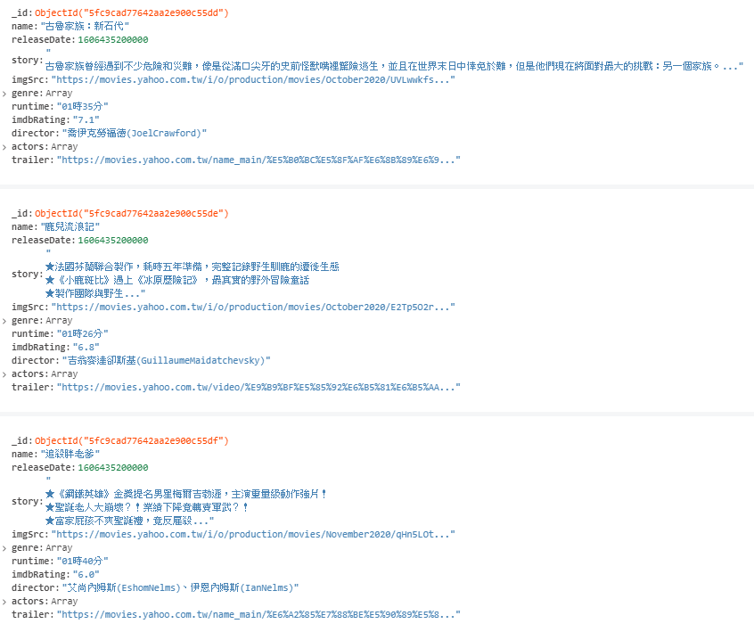

# Yahoo 電影資料爬蟲

## 使用套件
[jssoup](https://www.npmjs.com/package/jssoup)
[node cron](https://github.com/node-cron/node-cron)
[mongodb](https://docs.mongodb.com/drivers/node/)
## 功能說明

### movieCrawler.js
**getMoviesThisWeekFromYahoo**: 抓取 [yahoo本週新片頁面](https://movies.yahoo.com.tw/movie_thisweek.html)，並解析 html 元素將電影的名稱、片長、簡介等，然後存到資料庫。

**getMoviesInTheatersFromYahoo**: 抓取 [yahoo上映中頁面](https://movies.yahoo.com.tw/movie_intheaters.html?page=1)，並解析 html 元素將電影的名稱、片長、簡介等，然後存到資料庫。

### cron.js
此檔案會執行一個排程`cron.schedule`，每天的晚上11點會自動執行**getMoviesThisWeekFromYahoo** 與 **getMoviesInTheatersFromYahoo**，抓取最新電影資料。

### dbController.js
**insertMovieThisWeekToDB**: 將 **getMoviesThisWeekFromYahoo** 得到的電影資料插入資料庫的本週新片表格。
**insertMovieInTheatersToDB**: 將 **getMoviesInTheatersFromYahoo** 得到的電影資料插入資料庫的上映中表格。
